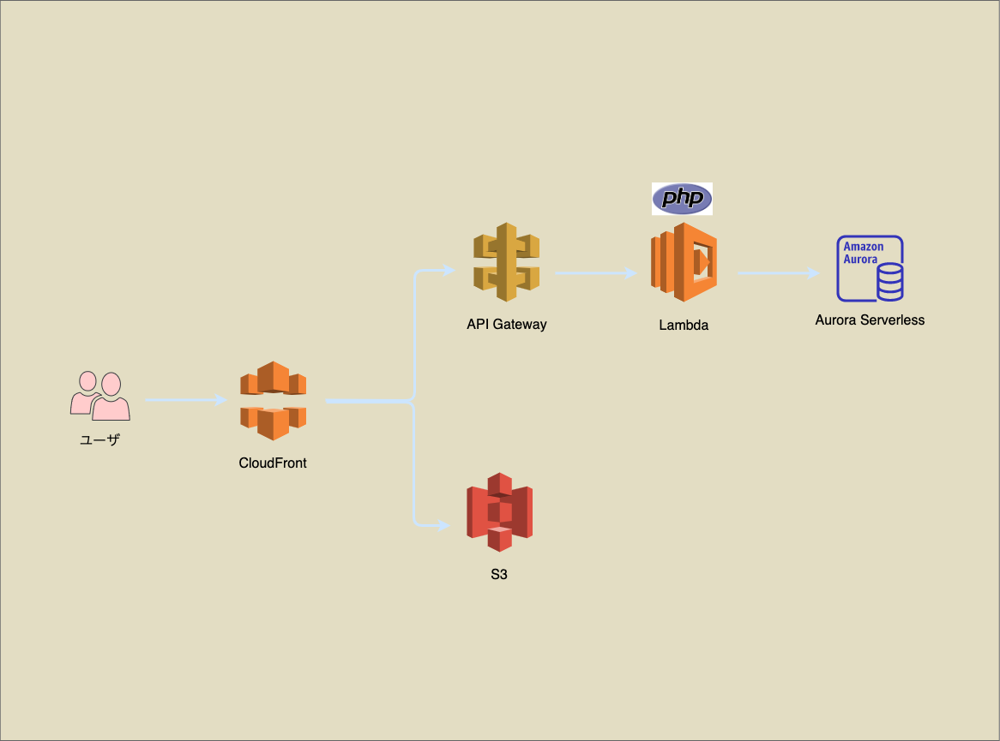
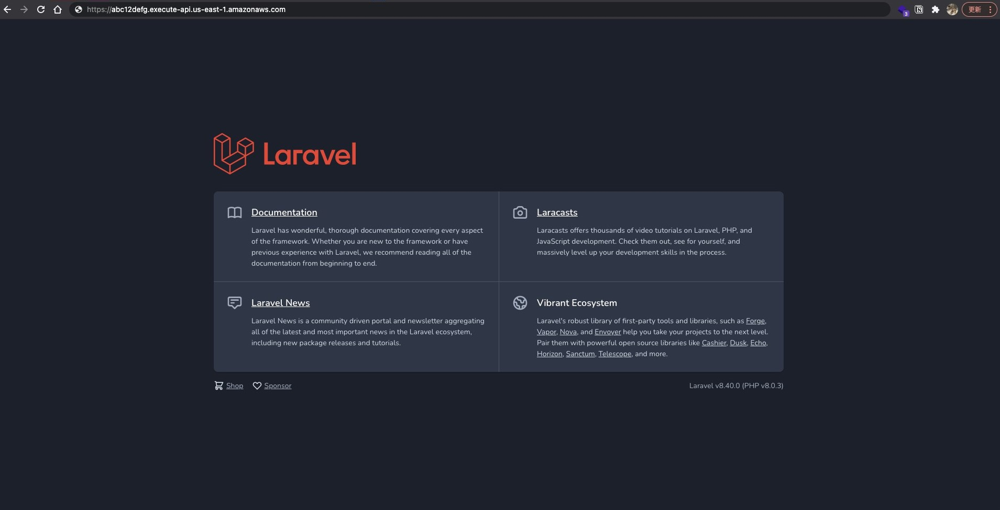

<!-- _class: cover lead -->



## Bref と Serverless Framework で作る
# AWS サーバーレス LAMP スタック

@ysmtegsr

---

<!--
header: 'サーバーレス初心者 LT >> Bref と Serverless Framework で作る AWS サーバーレス LAMP スタック'
paginate: true
class: slides
-->

## 本日のアジェンダ

1. 自己紹介
2. 従来の LAMP スタックの課題
3. AWS サーバーレス LAMP スタックとは
4. 使用したサービスやライブラリなど
   - Laravel Sail
   - Bref
   - Serverless Framework
5. まとめ

---

<!-- _class: invert -->
# 自己紹介:police_officer:

---

<!-- _class: profile -->


- [ヨッシー(@ysmtegsr)](https://twitter.com/ysmtegsr)
  - 
  - 
  - 
- :police_officer: 防衛大卒の新卒 3 年目の Z 世代
- :luggage: スクラムマスター、バックエンドエンジニア
- :eyes: AWS、Laravel、コンテナ、Jamstack
- :heart: 読書、将棋、テニス、筋トレ
- :page_with_curl: AWS CLF, AWS SAA

---

<!-- _class: invert -->

# サーバーレス LAMP スタック:thinking:

---

## 従来の LAMP スタック

- 下記のソフトウェア頭文字からなる造語
  - **L**：**L**inux
  - **A**：**A**pache HTTP Server、
  - **M**：**M**ariaDB、**M**ySQL
  - **P**：**P**HP、**P**erl、**P**ython
- 動的な Web サイトやアプリケーションの開発
- OSS = 無償提供 = 無保証

---

## 従来の LAMP スタックの課題

- **突発的なアクセス増加**に耐えるスケーラビリティの必要性。
- **運用や保守、監視**などの仕組み。
- 常にサーバを立ち上げておくのに発生する**固定費**。
- その他
  - セッション管理
  - 静的コンテンツの配信

---

## AWS サーバーレス LAMP スタック

- 下記のソフトウェア頭文字からなる造語
  - **L**：AWS **L**ambda
  - **A**：Amazon **A**PI Gateway
  - **M**：Amazon Aurora Serverless(**M**ySQL エンジン)
  - **P**：**P**HP Runtime Layer For AWS Lambda
- ハイスケーラビリティ
- 運用負荷が少ない
- 高いコストパフォーマンス

---


---

<!-- _class: invert -->

<!-- # PHP on Lambda ？

--- -->

<!-- _class: invert -->
# 作ってみる :rocket:

---

## ローカル環境

[Laravel Sail](https://readouble.com/laravel/8.x/ja/sail.html) を使って Docker 環境を 2 撃で立ち上げる。

- Laravel アプリケーションを Docker 上で動作させるための軽量 CLI
- docker-compose.yml と Sail スクリプトからなる


```sh
$ curl -s "https://laravel.build/<PROJECT_NAME>" | bash && cd <PROJECT_NAME>

$ ./vendor/bin/sail up -d
# docker-compose up -d と同様
```

---

## Bref の導入

AWS Lambda 上で Laravel や Symfony などの PHP フレームワークを簡単に動作させるための便利ツール。

1. ライブラリのインストール

```sh
$ ./vendor/bin/sail composer require bref/bref bref/laravel-bridge
```

2. Serverless Framework 用の YAML ファイルを生成

```sh
$ ./vendor/bin/sail artisan vendor:publish --tag=serverless-config
Copied File [/vendor/bref/laravel-bridge/config/serverless.yml] To [/serverless.yml]
Publishing complete.
```

---

## Serverless Framework で構築

Serverless Framework とは、**サーバーレスアプリケーションの構築、管理、デプロイをするためのツール**

1. serverless.yml の確認
<!-- 2. Laravel 設定を微修正 -->
2. Serverless Framework CLI でデプロイ

---

### serverless.yml 確認(1)

```yaml
service: sample-laravel
provider: # {  AWS | GCP | Azure } など、どのプロバイダを使うか
  name: aws
  region: us-east-1 # AWS リージョン
  stage: dev  # { dev | stg | prod } などの環境を指定
  runtime: provided.al2
package: # デプロイパッケージ
  exclude:
    - node_modules/**
    - public/storage
    - resources/assets/**
    - storage/**
    - tests/**
...
```

---

### serverless.yml 確認(2)

```yml
...
# Lambda 関数
functions:
  web:
    handler: public/index.php
    timeout: 28 # API Gateway のタイムアウト時間が 29 秒
    layers:
      - ${bref:layer.php-80-fpm}
    events: # API Gateway を Lambda 関数のトリガーにする
      - httpApi: '*'

plugins:
  - ./vendor/bref/bref
```

---

### Serverless Framework でデプロイ

```sh
$ serverless deploy

service: sample-laravel
stage: dev
region: us-east-1
stack: sample-laravel-dev
resources: 11
endpoints:
  ANY - https://uksl8vejck.execute-api.us-east-1.amazonaws.com
functions:
  web: sample-laravel-dev-web

Stack Outputs
WebLambdaFunctionQualifiedArn: arn:aws:lambda:us-east-1:648608884667:function:sample-laravel-dev-web:1
HttpApiId: abc12defg
ServerlessDeploymentBucketName: sample-laravel-dev-serverlessdeploymentbucket-123abc456defg
HttpApiUrl: https://abc12defg.execute-api.us-east-1.amazonaws.com  # ← アクセス !!
```

---



---

<!-- _class: invert -->

# 構築してみての所感:thinking:


---


構築してみての所感

- 構築、デプロイの容易さ
  - Bref や Serverless Framework の存在
- 課題
  - serverless.yml はファイルを分割する
  - Lambda と Fargate の使い分けの判断
  - ローカル環境をどう作るか


---

<!-- _class: invert -->

# まとめ:dizzy:

---

## まとめ

- AWS サーバーレス LAMP スタック
  1. **ハイスケーラビリティ**
  2. **運用負荷も小さく**抑えられ
  3. **コストパフォーマンスが高い** 未来の LAMP スタック
- AWS Lambda で PHP フレームワークを使う時は **Bref** が便利
- Serverless Framework は**インフラのコード化**と**デプロイの容易さ**の両方を提供してくれる優れもの
- 場合に応じたアーキテクチャ選定を

---

<!-- _class: invert -->

# ご静聴ありがとうございました🙇‍♂️
