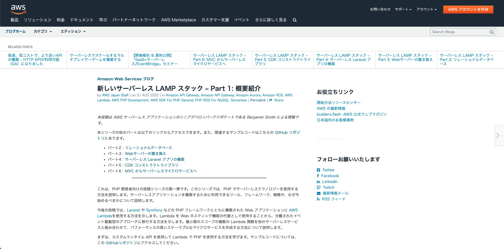

<!-- _class: cover lead -->


## サーバーレス初心者による
# 初めての AWS Lambda

@ysmtegsr

---

<!-- _class: invert -->

# LT 初登壇 :partying_face:

---

<!--
header: 'サーバーレス初心者 LT >> サーバーレス初心者による初めての AWS Lambda '
paginate: true
class: slides
-->

## アジェンダ

1. 自己紹介

2. 今日伝えたいこと

3. きっかけ

4. サーバーレスな Laravel アプリケーションを作ってみた

5. 作ってみての所感

6. まとめ

---

<!-- _class: invert -->
# 自己紹介:police_officer:

---

<!-- _class: profile -->


- よっしー([@ysmtegsr](https://twitter.com/ysmtegsr))
  - 
  - 
  - 
- :police_officer: 防衛大卒の新卒 3 年目の Z 世代
- :luggage: スクラムマスター、バックエンドエンジニア
- :eyes: AWS、Laravel、コンテナ、Jamstack
- :heart: 読書、将棋、テニス、筋トレ

---

<!-- _class: invert -->

# 今日伝えたいこと :eyes:

---

# とりあえず触ってみる精神！

---

<!-- _class: invert -->

# これまでの自分 :baby:

---

## これまでの自分

- サーバーレスの良さも分かっているし
- AWS Lambda についても知ってはいる

でも…

---

## これまでの自分

- サーバーレスの良さも分かっているし
- AWS Lambda についても知ってはいる

でも…

- 一番よく使っている PHP はサポートはされていない
- 業務の技術選定されるのかな

---

## これまでの自分

- サーバーレスの良さも分かっているし
- AWS Lambda についても知ってはいる

でも…

- PHP はサポートはされていない
- 業務の技術選定されるのかな

そこでたまたま見かけたのが…

---



---

<!-- _class: invert -->

# サーバーレス LAMP スタック:thinking:

---

## サーバーレス LAMP スタック

- 下記のソフトウェア頭文字からなる造語
  - **L**：AWS **L**ambda
  - **A**：Amazon **A**PI Gateway
  - **M**：Amazon Aurora Serverless(**M**ySQL エンジン)
  - **P**：**P**HP Runtime Layer For AWS Lambda
- ハイスケーラビリティ
- 運用負荷が少ない
- 高いコストパフォーマンス

---


---

<!-- _class: invert -->

<!-- # PHP on Lambda ？

--- -->

<!-- _class: invert -->
# やってみた :rocket:

---

## ライブラリの導入

#### :star: Bref

AWS Lambda 上で PHP を簡単に動作させるための便利ツール。

#### :star: laravel-bridge

Laravel を Lambda 用に動作するようにしてくれる便利ツール。

---

## インフラの構築とデプロイ

#### :star: Serverless Framework

- サーバーレスアプリケーションの構築、管理、デプロイをするためのツール。
- CLI で操作が可能。

```sh
$ serverless deploy

Stack Outputs
WebLambdaFunctionQualifiedArn: arn:aws:lambda:us-east-1:648608884667:function:sample-laravel-dev-web:1
HttpApiId: abc12defg
ServerlessDeploymentBucketName: sample-laravel-dev-serverlessdeploymentbucket-123abc456defg
HttpApiUrl: https://abc12defg.execute-api.us-east-1.amazonaws.com
```

---

<!-- _class: invert -->

# 作ったもの

---

<!-- _class: invert -->

### Welcome ページ


---

### GET /sample

```sh
$ curl https://vnt27c2h3j.execute-api.ap-northeast-1.amazonaws.com/sample | jq .

{
  "message": "Hello World!"
}
```

---

### GET /users

```sh
$ curl https://vnt27c2h3j.execute-api.ap-northeast-1.amazonaws.com/users | jq '.user[] | .name'

"Buford Gerhold"
"Stuart Daniel"
"River Rath"
"Ryann Kessler"
"Erin Jones DVM"
"Rylee Toy"
"Evalyn Hammes"
"Stone Hettinger"
"Lupe Langosh"
"Agustin Parisian"
```

---

<!-- _class: invert -->

# 作ってみての所感 :thinking:


---

## 作ってみての所感

- 構築、デプロイの容易さ

- サーバーレスのメリットを肌で感じた
  - 実装に集中できる
  - コストパフォーマンス


---

<!-- _class: invert -->

# まとめ:dizzy:

---

## まとめ

- AWS Lambda は**好きな言語**で始めよう！

- 雰囲気掴むのには**とりあえず触ってみる精神**が大事！

- 何事も行動あるのみ（自戒を込めて）

---

<!-- _class: invert -->

# ご静聴ありがとうございました🙇‍♂️
