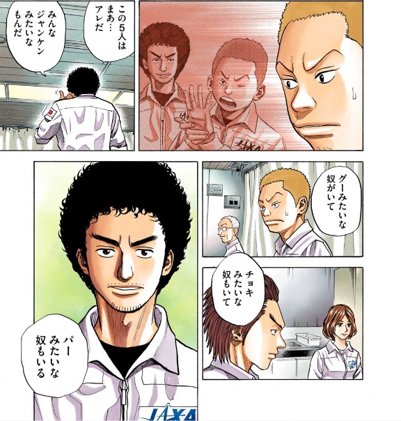

<!-- _class: cover lead -->

## 効率よく成長するために
# 自分の強みを知る方法

よっしー(@ysmtegsr)

---

<!--
header: '効率よく成長するために自分の強みを知る方法'
paginate: true
class: slides
-->

## アジェンダ

1. 自己紹介
2. 今日伝えたいこと
3. ストレングス・ファインダーとは
4. 診断方法
5. まとめ

---

<!-- _class: invert -->
# 自己紹介:police_officer:

---

<!-- _class: profile -->

- よっしー([@ysmtegsr](https://twitter.com/ysmtegsr))
  - 
  - 
  - 
- :police_officer: 防衛大卒の新卒 3 年目の Z 世代
- :luggage: スクラムマスター、バックエンドエンジニア
- :eyes: AWS、Laravel、コンテナ、Jamstack
- :heart: 読書、将棋、テニス、筋トレ

---

# あなたの強みってなんですか？:thinking:

---

<!-- _class: invert -->

# 今日伝えたいこと:point_up:

---

# 自分の強みを知るって大事！

---

### 自分の強みを知る

- 人には得意不得意がある
- 完璧な人間なんていない
- 自分に自信を持てるようになる
- 自分自身だけでなく他人との関係にも活用できる

---

<!-- _class: invert -->

# ストレングス・ファインダー:eyes:

---

## ストレングス・ファインダーとは

---

## ストレングス・ファインダーとは

- オンライン「才能診断」ツール
- 34 の資質
  - 才能を 34 の資質に分類
  - そのうち特徴的な 5 つをピックアップ
- 企業でも導入
  - 社内コミュニケーションにも:+1:

---

<!-- _class: invert -->

# 僕の例:police_officer:

---

---

## 強み

1. 最上志向
2. 自我
3. 競争性
4. 親密性
5. 戦略性

---

## 弱み

30. 包含
31. 運命思考
32. 社交性
33. 調和性
34. 公平性

---

<!-- _class: invert -->

# 診断方法:newspaper:

---

## プラン

- 通常プラン
  - TOP 5 の強みのみを知りたい場合
  - 約 2,300 円

---

## プラン

- 通常プラン
  - TOP 5 の強みのみを知りたい場合
  - 約 2,300 円
- 全 34 資質の順位を知りたい場合
  - 約 6,000 円

---

## 診断方法

- 書籍を購入
- Gallup 公式サイト
  - https://www.gallup.com
- スマホアプリ
  - iOS
  - Android

---

<!-- _class: invert -->

# まとめ:pray:

---

## まとめ

- 自分の資質についてよく理解しよう！
  - 強みを伸ばす
  - 弱みは誰にでもある
- さらにコーチングを受けてみても良いかも
- 是非自分の強みを知るきっかけに！

---

<!-- _class: invert -->

# ご静聴ありがとうございました🙇‍♂️
