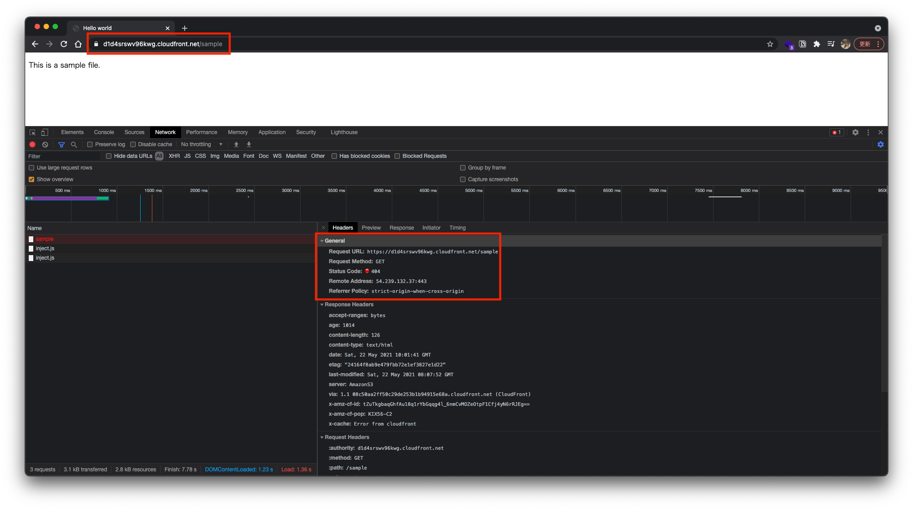
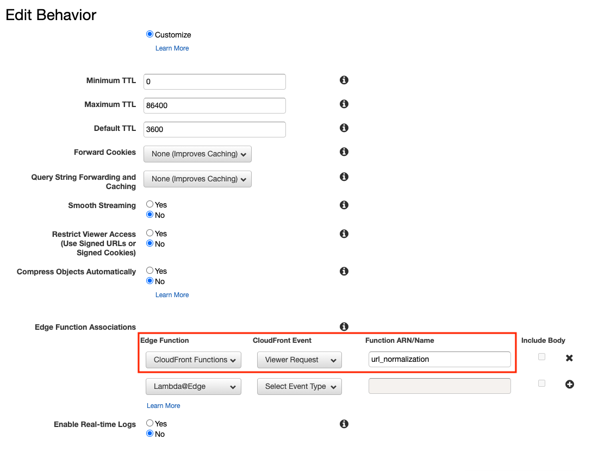
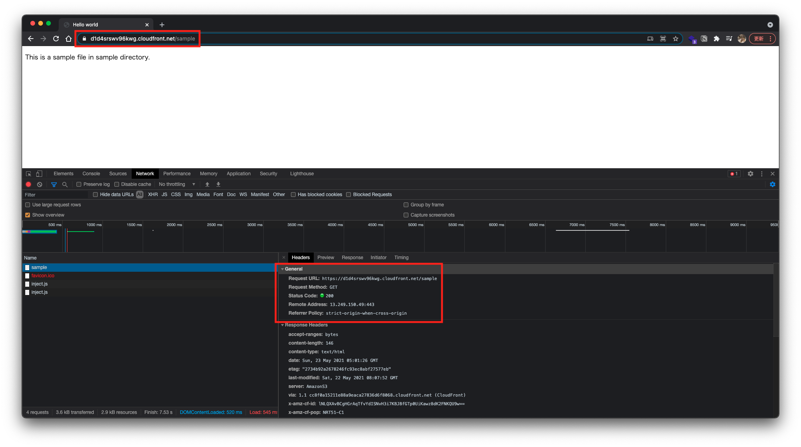

<!-- _class: cover lead invert -->


## 新機能紹介！
# CloudFront Functions を触ってみた

えが(@ega4432)

---

<!--
header: '新機能紹介！CloudFront Functions を触ってみた'
paginate: true
class: slides
-->

## アジェンダ

1. Amazon CloudFront とは
2. Lambda@Edge とは
3. CloudFront Functions とは
4. CF2 の注意点
5. CF2 のユースケース
6. URL 正規化をやってみた
7. まとめ

---


<!-- _class: invert -->

# Amazon CloudFront とは

---

## CloudFront とは

**「AWS の CDN サービス」**

- 静的、動的なコンテンツを高速配信
- セキュア
- ユーザを近いエッジロケーションに誘導
- エッジコンピューティングが利用可能


---

<!-- _class: invert -->

# Lambda@Edge とは

---

## Lambda@Edge とは

エッジで Lambda 関数を実行できる機能。


---

<!-- _class: invert -->

# CloudFront Functions とは

---

## CloudFront Functions とは

Lambda@Edge よりも安価で軽量な処理を実行できる機能。


---

<!-- _class: invert -->

# CF2 の注意点

---

## CF2 の注意点

Lambda@Edge よりも縛りが多い

- 実行時間の制限 1ms
- 最大メモリ 2MB
- ランタイムは JavaScript だけ


---

<!-- _class: invert -->

# CF2 のユースケース

---

## CF2 のユースケース

- HTTP リクエスト／レスポンスの操作
- URL の書き換えやリダイレクト
- キャッシュの操作
- JWT などによるアクセス制御

---

<!-- _class: invert -->

# URL 正規化をやってみた

---

### 構成



```sh
$ aws s3 ls s3://cloudfront-functions-sample --recursive
.
├── index.html
└── sample
    └── index.html
```

---

sample というオブジェクトは存在しないので 404 になってしまう




---

### 目指すかたち

下記のようにリクエスト URL を正規化できれば良さそう！

- `/` -> `/index.html`
- `/sample` -> `/sample/index.html`
- `/sample/` -> `/sample/index.html`
---



---



---

<!-- _class: invert -->

# まとめ

---


## まとめ

- CloudFront Functions めちゃくちゃ良さそう！
- Lambda@Edge との使い分けが重要


---


<!-- _class: invert -->
# ご静聴ありがとうございました🙇‍♂️
