<!-- _class: cover lead -->

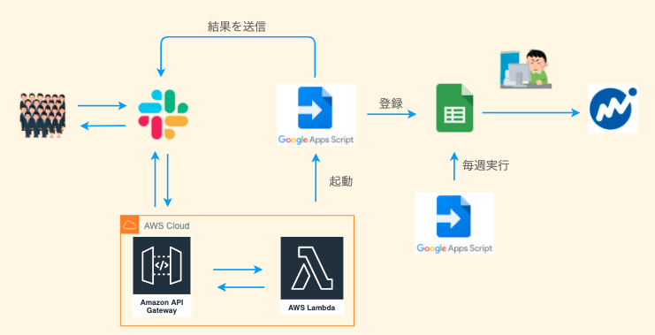

## サーバーレスな技術を使って
# オフィス業務を改善した話

よっしー(@ysmtegsr)
Serverless LT初心者向け LT大会

---

<!-- _class: profile -->


- よっしー([@ysmtegsr](https://twitter.com/ysmtegsr))
  - 
  - 
  - 
- :police_officer: 防衛大卒の新卒 3 年目の Z 世代
- :luggage: スクラムマスター、バックエンドエンジニア
- :eyes: AWS、Laravel、コンテナ、Jamstack
- :heart: 読書、将棋、テニス、筋トレ

---

<!--
header: 'サーバーレスな技術を使って オフィス業務を改善した話'
paginate: true
class: slides
-->

## アジェンダ

1. 今日お話しすること

2. きっかけ・課題

3. 解決するためにやったこと

4. ハマりポイント

5. 解決策

6. まとめ

---

<!-- _class: invert -->

# 今日お話しすること :art:

---

## 今日お話しすること

**Google Apps Script ( GAS ) を使って総務の業務改善をした話と
それを行った際のハマりポイント & AWS を使った解決策の紹介**

---

<!-- _class: invert -->

# きっかけ・課題 :thinking:

---

### 備品発注のフロー

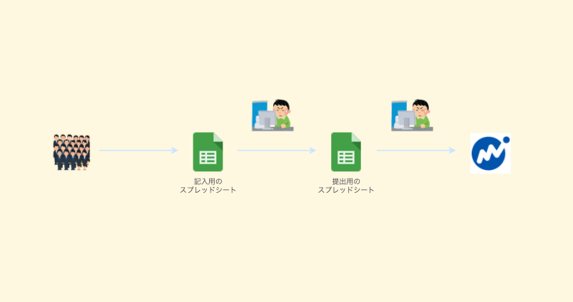

---

### 課題① インターフェース

- 人によってフォーマットを逸脱してしまう可能性
- 都度スプレッドシートを探す手間が発生
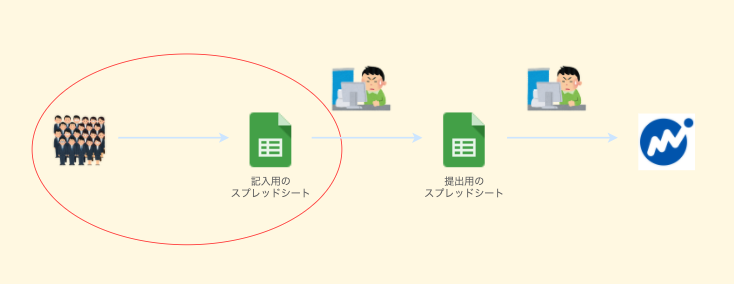

---

### 課題② 二重管理

- 用途は違うが、同じデータのスプレッドシートが 2 つ存在
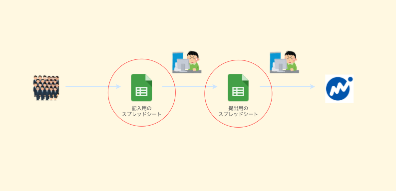

---

### 課題③ 毎週発生する定型業務

- 記入用 → 提出用のコピーは手動で運用
- 個人に依存したタスク
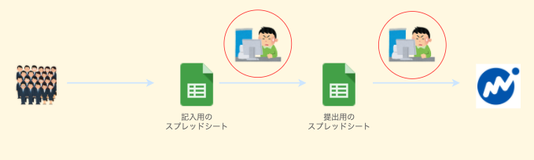

---

<!-- _class: invert -->

# 解決するために作ったもの :muscle:

---

### 全体像

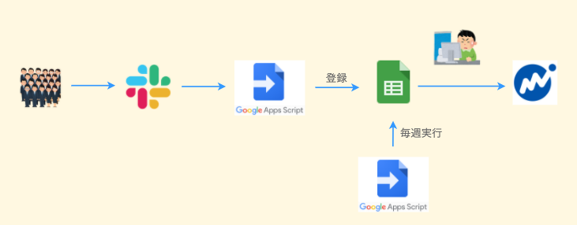

---

#### ① インターフェースを Slack に

- Slack をインターフェースにすることで業務中にストレスなく使用
  - スラッシュコマンドで呼び出し
  - 入力モーダル表示
- スキーマの統一、バリデーションが可能に

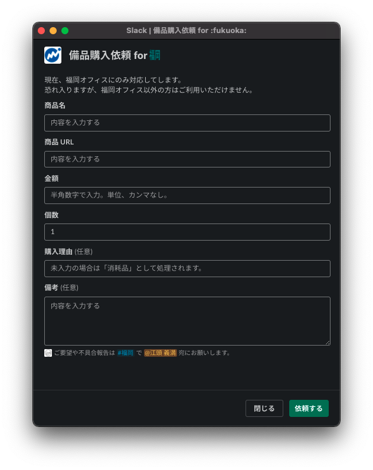

---

#### ② 記入用スプレッドシートの廃止

- 投稿内容の通知
  - 記入者は自身が投稿した内容を確認できる
  - ログが Slack 上に残る

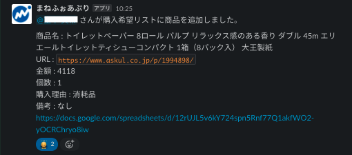

---

#### ③ 定型業務をバッチ化

- 状況に応じて送信メッセージを動的に変更
- 合計金額の算出やシートのアーカイブ、複製なども自動化

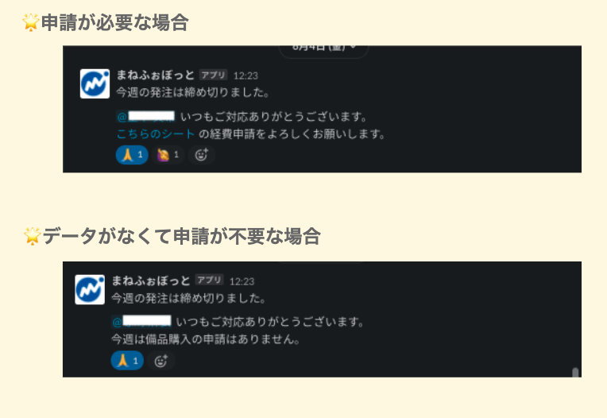

---

<!-- _class: invert -->

<!-- # 解決するためにやったこと :muscle: -->

<!-- --- -->

<!-- ## 解決するためにやったこと

- Slack スラッシュコマンドの構築
  - スプレッドシートへ登録する API
- 毎週の定型業務を自動化
  - スプレッドシートの更新、アーカイブ、新規作成
  - 担当者へ Slack 通知 -->

<!-- --- -->

<!-- ## Slack スラッシュコマンドの構築 -->


<!-- --- -->

<!-- _class: invert -->

# ハマりポイント :cry:

---

## ハマりポイント

##### Slack API の 3 秒ルール

- Slack が HTTP リクエストを投げてから 3 秒以内に HTTP レスポンスを受け取らないとタイムアウトになる。
- GAS は処理途中でレスポンスを返してしまうと後続の処理は実行されない。

---

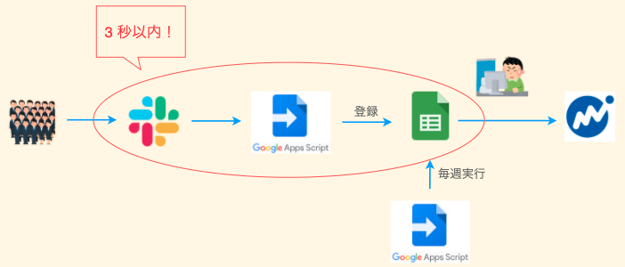

---

<!-- _class: invert -->

# 解決策 :sunglasses:

---

## 解決策

##### Slack 公式 Bolt フレームワーク :zap:

- Slack API を使いやすくするための Node.js 製フレームワーク。
- `ack()` という関数をサポートしており、HTTP レスポンス 200 を返しつつ後続の処理も実行可能。

---

### Example Code

```js
// モーダルの回答を送信した時の処理
app.view('hoge', async ({ ack, view }) => {
  // この時点で HTTP 200 を返す
  await ack();

  // 後続する重たい処理を非同期実行
  await heavyJob();
});
```

---

### AWS に乗せる

- **API Gateway + Lambda** で API 化
- 構築には **Serverless Framework** を使用

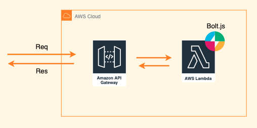

---
#### 最終的な構成


---

<!-- _class: invert -->

# まとめ :dizzy:

---

## まとめ

- 身の回りの課題をどう技術で解決できるか考えるのって楽しい！
  - 不定期な処理、何か小さく始める際**サーバーレス**は相性が良い
- Slack bot を実装する際は 3 秒ルールに気をつけよう！
  - Bolt がソリューションを提供してくれている

---

<!-- _class: invert -->

# ご静聴ありがとうございました🙇‍♂️
